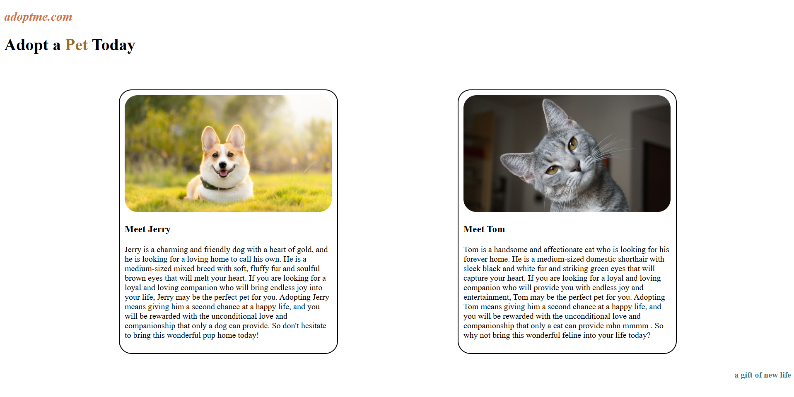

 # 🐾 Pet Adoption Website

A simple and responsive pet adoption webpage built using HTML and CSS.

## 🚀 Features

* Clean card-based UI
* Responsive design using Flexbox
* Pet profiles with images and descriptions

## 🛠 Tech Stack

* HTML
* CSS

## 🌐 Live Demo

👉  https://agarwalmanish3922-code.github.io/pet-adoption-website/

## 📸 Preview

## 💡 What I Learned

* Flexbox layout
* Responsive design
* CSS styling

## 📂 How to Run

1. Download or clone the repository
2. Open `index.html` in your browser

---

✨ Beginner-friendly frontend project
